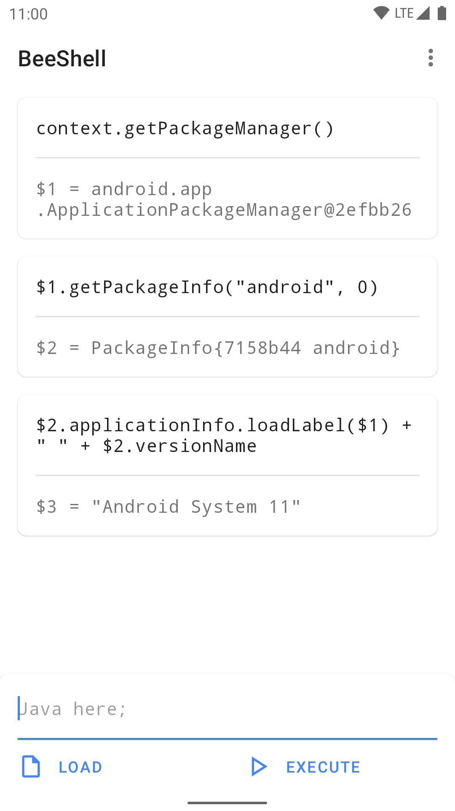
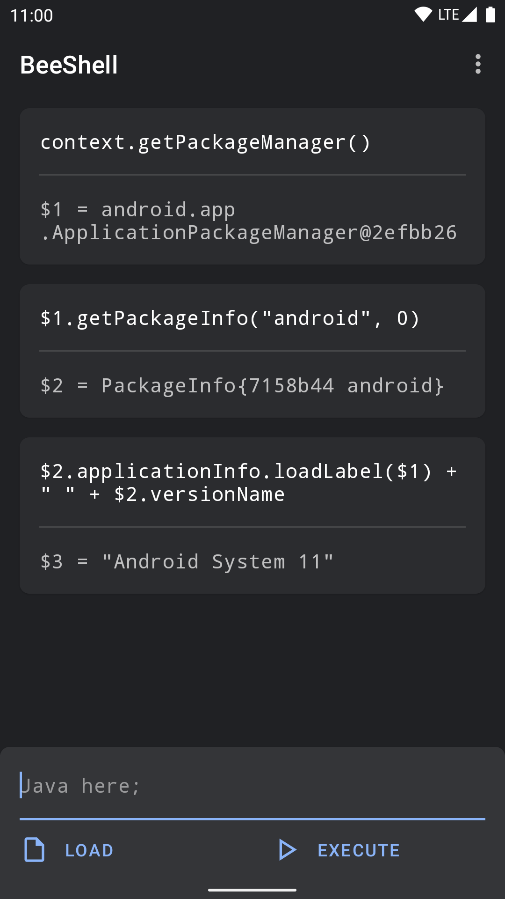

# BeeShell

[](https://github.com/zhanghai/BeeShell/actions) [](https://github.com/zhanghai/BeeShell/releases) [](LICENSE)


Java REPL on Android with [BeanShell](https://github.com/beanshell/beanshell).

Useful for quickly checking some framework API behavior, or calling Java APIs with the permissions of ADB shell.

This is not an officially supported Google product.

## Preview

<a href="https://play.google.com/store/apps/details?id=me.zhanghai.android.beeshell" target="_blank"></a>

[Download APK](https://github.com/zhanghai/BeeShell/releases/latest/download/app-release.apk)

<p>
</p>

## Built-ins

The application `Context` is available via the `context` variable in the global namespace.

An `Activity` instance is also available as `activity` when running with UI, and references to it in the global namespace will be cleared upon rotation to avoid memory leaks.

Other BeanShell built-ins are also available, though not guaranteed to work, e.g. Swing-based UI built-ins won't work on Android.

## Running in ADB shell

Execute the following command in `adb shell`:

```
pm_path=`pm path me.zhanghai.android.beeshell` && apk_path=${pm_path#package:} && `dirname $apk_path`/lib/*/libbsh.so
```

## Limitation

[BeanShell](https://github.com/beanshell/beanshell) was written for running on a desktop JVM instead of Android, and as a result class-related Java syntax may be unsupported in this app. Specifically, you cannot define new classes except for anonymous inner classes implementing an existing interface.

## License

    Copyright 2020 Google LLC

    Licensed under the Apache License, Version 2.0 (the "License");
    you may not use this file except in compliance with the License.
    You may obtain a copy of the License at

        https://www.apache.org/licenses/LICENSE-2.0

    Unless required by applicable law or agreed to in writing, software
    distributed under the License is distributed on an "AS IS" BASIS,
    WITHOUT WARRANTIES OR CONDITIONS OF ANY KIND, either express or implied.
    See the License for the specific language governing permissions and
    limitations under the License.
